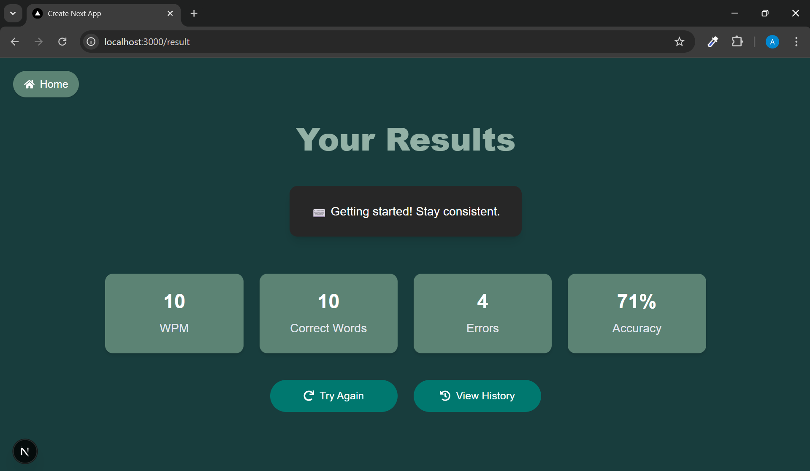

# Typocalypse – Typing Speed Tester & Progress Tracker

Typocalypse is a sleek and interactive typing test web platform that helps users improve typing speed and accuracy. With customizable test durations and real-time feedback on WPM, errors, and accuracy, users can practice, track progress, and view their performance history — all in a responsive, modern UI.

## Features

- Adjustable test durations (15s, 30s, 60s)
- Real-time tracking of:
  - WPM (Words Per Minute)
  - Accuracy
  - Error count
- Dynamic text fetching using Bacon Ipsum API
- Persistent history stored using LocalStorage
- Ability to delete individual history entries
- Animated UI with hover effects, progress bar, and intuitive layout
- Navigation across Home, Speed Test, Results, and History pages

## Tech Stack

- **Framework**: Next.js (App Router)
- **Language**: TypeScript
- **Styling**: Tailwind CSS
- **State & Logic**: React Hooks (useState, useEffect)
- **Data Handling**: Axios for fetching paragraphs
- **Storage**: LocalStorage for persisting typing history

## Folder Structure

<pre>
/typing-speed-tester
 ├── eslint.config.mjs
 ├── next.config.ts
 ├── package.json
 ├── package-lock.json
 ├── postcss.config.mjs
 ├── README.md
 ├── tsconfig.json
 ├── project_images
 │   ├── history_page.png
 │   ├── home_page.png
 │   ├── result_page.png
 │   └── typing_page.png
 ├── public
 └── src
     ├── app
     │   ├── page.tsx          // Home Page
     │   ├── speed/page.tsx    // Typing Test Page
     │   ├── result/page.tsx   // Result Page
     │   └── history/page.tsx  // History Page
     ├── components
     │   ├── TypingArea.tsx
     │   ├── Timer.tsx
     │   ├── ProgressBar.tsx
     │   └── TestDurationSelector.tsx
     └── utils
         ├── calculations.ts   // WPM, Accuracy, Errors
         └── storage.ts        // LocalStorage operations
</pre>

## Setup Instructions

1. **Clone the repository**
   ```bash
   git clone https://github.com/yourusername/typocalypse.git
   ```

2. **Navigate to the project directory**
   ```bash
   cd typocalypse
   ```

3. **Install dependencies**
   ```bash
   npm install
   ```

4. **Run the development server**
   ```bash
   npm run dev
   ```

5. **Open in browser**
   Visit `http://localhost:3000` to use the application.

## Screenshots

### Home Page


### Typing Page


### Result Page


### History Page

